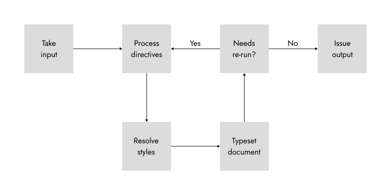

# How Emblem Works

In this document, we will discuss the [how documents are processed](#the-typesetting-loop), [how documents are styled](#styling-documents-with-css), [extensions](#extensions) and [input and output drivers](#input-and-output-drivers).

At its most abstracted level, Emblem takes input of a document, typesets it and outputs it.
It does this by parsing its input looking for _directives,_ structuring-calls calls which sub-divide a document’s source, which can apply both styles to and perform computation upon document content.
Emblem contains a [standard library of directives][std] to facilitate many common tasks encountered when writing.
For example, to create a document with a table of contents and some headings, something akin to the following could be used.

```emblem
.toc // Constructs the table of contents
.h1: Hello, world!
This is my first document.
```

If this is in a file called `my-first-doc.em`, we can typeset it by executing the following.

```bash
em my-first-doc
```

As one might expect, this creates a table of contents followed by a level-1 header and then a some text.
The `.h1` directive is a good example of what directives can do as it applies both the `.h1` _style_ (by default is an emboldened and enlarged form of main text) and computes the heading number.
This latter follows the convention of technical documents for headings and sub-headings, so for example the heading numbered 2.5.3 would be the third sub-sub-heading under the fifth sub-heading in the second section of a document.

The order in which elements are computed leads us to the first defining feature of Emblem.

## The typesetting Loop

Emblem processes its input from start to finish and whilst this lends itself naturally to some concepts, it is somewhat at-odds with others.
A notable example of this latter case is the creation of a table of contents.
As is both customary and seen in the above document, the table of contents is placed before the body of the text where the headings which it will contain are defined.
The problem is that when the table of contents is required, we cannot guarantee that headings have been processed, so Emblem would not be able to construct an accurate table of contents.

To alleviate this, Emblem operates a typesetting loop whereby it repeatedly typesets the document until either it has settled to a consistent state, or until a cut-off number of iterations is reached.
As such, the overall operation of Emblem can be considered as below.

<center>
	
</center>

The typesetting loop gives the user the guarantee that---with sufficiently-many iterations---the document output by Emblem will fully typeset after a single execution of the ‘em’ binary.
These docs also provide [more information on how to control the typesetting loop][typesetting-loop-control] elsewhere.
For now, however, we turn to the question of document styling.

## Styling documents with CSS

Writing documents inherently brings two concerns: the writing of good text to appeal to the mind, and the application of pleasant styles to appeal to the eye.
Naturally, when writing, some modicum of consideration must be lent to each, but they are naturally at-odds.
Given finite time, an author must decide how best to partition their efforts to please their audience.
In the extreme cases, we have on the one hand the screen-writer who, knowing their document is but a means to the realisation of their work, will choose to write using mono-spaced typefaces, with minimal concern of layout, and on the other hand the graphic designer who pours endless hours into the presentation and adjustment of but a few important words.

<!-- By using [CSS][css], this same dichotomy can be achieved, and with notable benefit to the writers of long-form documents. -->
<!-- Cascading Style Sheets are an expressive and extensible way of describing the appearance of a document, popularised by the web. -->
By making use of [_Cascading Style Sheets (CSS)_][css], Emblem supports this writers’ dichotomy.
CSS is an expressive and highly extensible method of applying visual information to structured documents and, through industrious use of its selection rules, an author can construct good abstractions for how their document will appear.
This allows styling information to be _automatically_ applied, thereby allowing the user to focus their attention entirely upon one of style and content, when the time comes.

A very useful example is in the insertion of indents at the start of paragraphs.
In long-form text in the Latin alphabet, the modern style starts each paragraph on the line immediately below the last and, to highlight the boundary, adds an indent to the first line of each paragraph after the first.
This allows the first paragraph to neatly sit upon the upper left reaches of its allotted space, the entire body of text to calmly flow uninterrupted, and for paragraphs to be clearly yet unobtrusively be delimited.
This can be concisely encoded through the use of CSS’s selectors as below.

```css
p { /* By default, paragraphs are not indented */
	text-indent: none;
}
p + p { /* A paragraph which directly follows another requires an indent */
	text-indent: 2em;
}
```

As a result of this short snippet, the author no longer needs to consider where paragraph indents are applied as it will be handled automatically.

The user is able to add their own styles by specifying some style sheet which can be used to override the defaults and thereby tailor the look of their document.

## Extensions

Automation and extensibility are at the heart of Emblem, and in this section we’ll describe how it is possible to direct Emblem to do some of the author’s work for them.
When a call to a directive, _d_, is evaluated, Emblem first checks to see whether _d_ is associated with an extension function.
If it is, then this function is executed and its result is taken to be a part of the document.
[An example of this can be seen above concerning the `.toc` directive](#how-emblem-works), which constructs a table of contents from headings.

Extensions are simply [Lua][lua] files and have two purposes in Emblem---the import of custom style sheets and the creation of new directive functions.
These style sheets are considered to be ‘above’ the user’s one, thus allowing for defaults to be created and overridden as required.
Conversely, directive functions have slightly more nuance.
As Emblem processes a document, it maintains a Lua environment which contains a _public table_ called ‘em.’
It is this table which is checked to determine whether a given directive name has an associated function to call.

Extensions can be added to the runtime by use of the `-x`/`--extension` option and arguments can be passed to these extensions through use of the `-a`/`--ext-arg` option.
For example, to include an extension `ext` with parameter `param` given a value `arg`, the following can be used.

```bash
em -x ext -a ext.param=arg
```

To define a new directive function, an extension simply adds an entry into the ‘em’ table,[^em-loc] alongside help text and the number of parameters it expects.
The entry also encodes some basic type information, so if a directive is called with the wrong number of arguments, a warning can be issued.
These entries also encode a help message which can be accessed through the `.help` directive.
The following example shows information about the `.echo` directive:

```emblem
.help{echo}
```

Being constructed from Lua, extensions allow for arbitrary functionality when writing a document, however this is not the only place where extensions can operate.

## Input and output drivers

The other place in Emblem where extensions are accepted is when the program takes input or writes output.
Until this point, we have only discussed the writing of documents in Emblem source files (`*.em`) however in truth, Emblem can parse _any_ format for which it has the appropriate input driver.
The same is true when writing output---the formats to which Emblem may output depend only the output drivers it knows.

These options can be accessed through the [command-line api][cli] by using the `-F`/`--from` and `-T`/`--to` options.
The following will take input of html and output markdown.

```bash
em -Fhtml -Tmd mydoc.html
```

The above is somewhat redundant---we have specified that the input file is `html` both explicitly with the `-F` option, but also implicitly with the `.html` file extension.
Therefore, Emblem also maintains a mapping of file-extensions to input languages and when no `-F` option is specified, the input file extension is used to determine the parser to use.
The core Emblem parser is used by default.

In the case of input drivers, it is also possible to access this same functionality from within a document, thus allowing for a document’s source to comprise of multiple languages as the author requires.
This is done through use of the `.include` directive.

```emblem
.include{some-file} // Includes some-file.em
.include{some-file.em} // Same as the above
.include{some-other-file.html}{html} // Includes ‘some-other-file.html’ using the html language explicitly
.include{some-other-file.html} // Same as the above but Emblem implictly figures out that the input language is ‘html’
```

Information on how to write [input drivers][input-drivers] and [output drivers][output-drivers] can be found elsewhere in these docs.

[css]: https://www.wikiwand.com/en/CSS
[lua]: https://www.lua.org
[std]: extension-api.md
[typesetting-loop-control]: ./controlling-the-typesetting-loop.md
[input-drivers]: writing-input-drivers.md
[output-drivers]: writing-output-drivers.md
[cli]: generated/command-line-args.md

[^em-loc]: The Emblem public table, ‘em,’ can be imported from [`std.base`](generated/ext/lib/std/base.moon.md)
